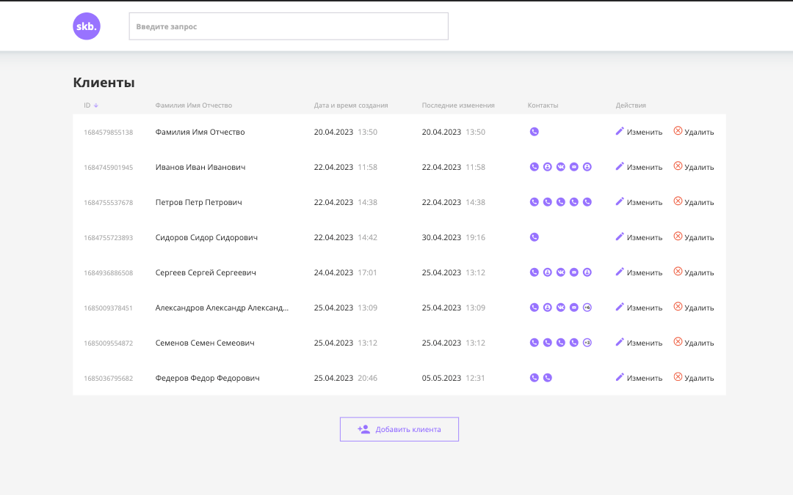
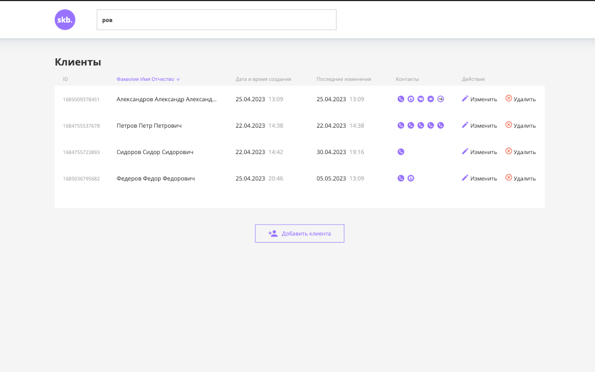
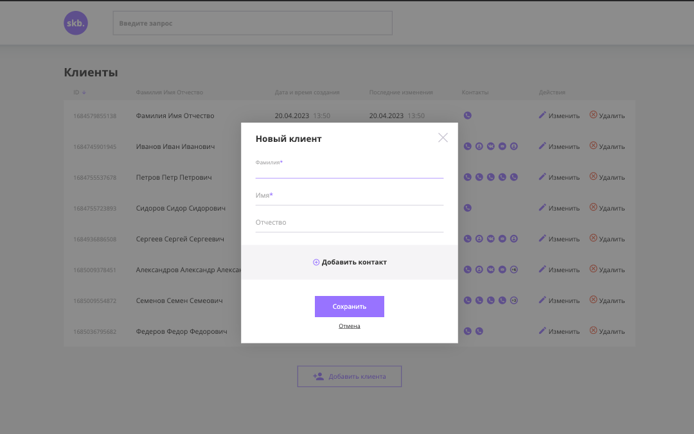
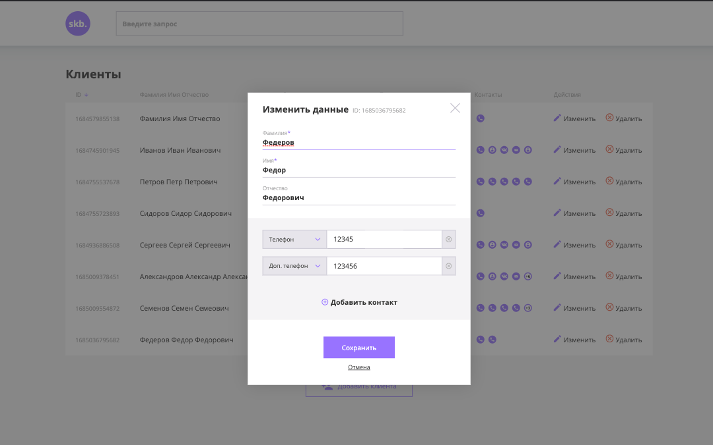
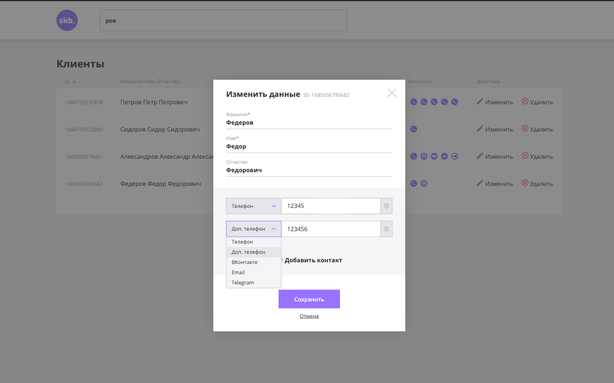
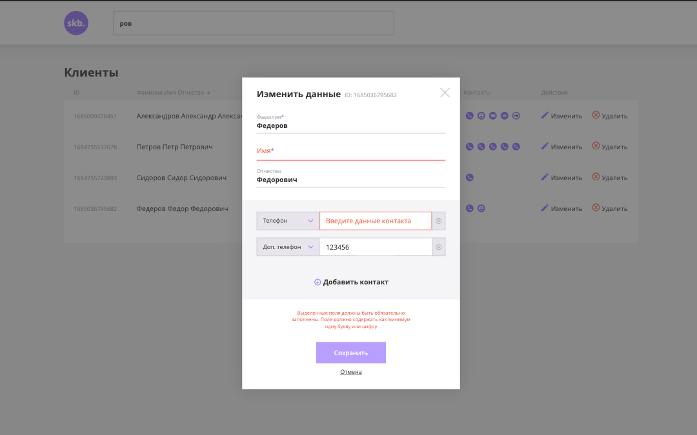
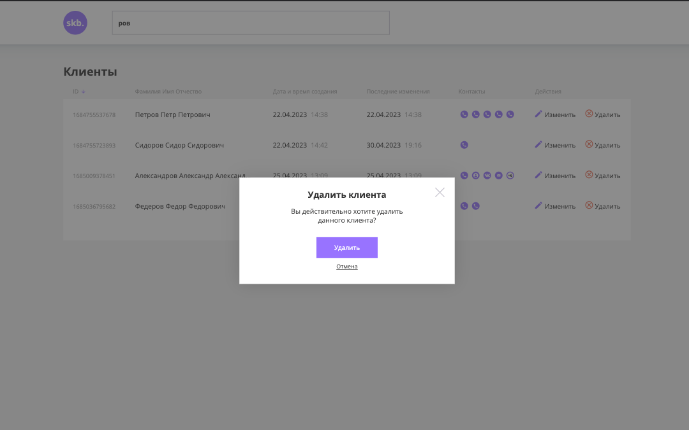

<h1 align="center">CRM-frontend</h1>

---
<h2 align="center">Available Scripts</h2>

npm run dev

npm run build

npm run lint

npm run preview

---
<h2 align="center">React 18, Typescript, Vite.</h2>

Axios, Classnames, Prettier, SASS 

---
Описание
---

Пользовательская часть приложения, списка клиентов.

 

Список клиентов можно сортировать по id, имени, дате создания, дате изменения.

Список можно отфильтровать по тексту в имени либо в контактах клиента.

 

Модальное окно добавления клиента.

 

Модальное окно изменения клиента.

 

Селект, как и все модальное окно, поддерживает управление с клавиатуры

 

При попытке отправки данны, выделены некорректно заполненные поля, и описание ошибки.

 

Модальное окно удаление клиента.

